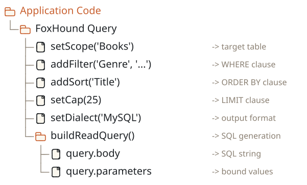

# FoxHound

> **[Read the Foxhound Documentation](https://fable-retold.github.io/foxhound/)** - interactive docs with the full API reference.

> A fluent query generation DSL for Node.js and the browser

FoxHound is a database query builder that generates dialect-specific SQL from a single chainable API.  It keeps your application code database-agnostic while producing safe, parameterized queries for MySQL, PostgreSQL, Microsoft SQL Server, SQLite, and ALASQL.

## Features

- **Chainable API** -- every configuration method returns the query object for fluent composition
- **Multiple Dialects** -- generate SQL for MySQL, PostgreSQL, MSSQL, SQLite, ALASQL, or plain English from the same code
- **Parameterized Queries** -- user-supplied values are always bound as named parameters, preventing SQL injection
- **Schema-Aware** -- automatic management of identity columns, timestamps, user stamps, and soft-delete tracking
- **Full CRUD + Count** -- build CREATE, READ, UPDATE, DELETE, UNDELETE, and COUNT queries
- **Query Overrides** -- underscore-style templates for custom SQL while retaining automatic parameter binding
- **Filtering & Sorting** -- rich filter expressions with multiple operators, logical grouping, and multi-column sorting
- **Joins & Pagination** -- INNER, LEFT, and custom joins plus dialect-aware LIMIT/OFFSET pagination
- **Fable Integration** -- operates as a Fable service, inheriting configuration, logging, and UUID generation

## Quick Start

```javascript
const libFable = require('fable');
const libFoxHound = require('foxhound');

const _Fable = new libFable({});
const tmpQuery = libFoxHound.new(_Fable);

tmpQuery
    .setScope('Books')
    .setDataElements(['Title', 'Author', 'PublishedYear'])
    .addFilter('Genre', 'Science Fiction')
    .addSort({Column: 'PublishedYear', Direction: 'Descending'})
    .setCap(25)
    .setDialect('MySQL')
    .buildReadQuery();

console.log(tmpQuery.query.body);
// => SELECT `Title`, `Author`, `PublishedYear` FROM `Books`
//    WHERE `Books`.`Genre` = :Genre_w0 ORDER BY PublishedYear DESC LIMIT 25;

console.log(tmpQuery.query.parameters);
// => { Genre_w0: 'Science Fiction' }
```

## Installation

```bash
npm install foxhound
```

## How It Works

FoxHound follows a configure-then-build pattern.  You create a query instance, chain configuration methods to set the table, columns, filters, sorts, and dialect, then call a build method to generate the SQL.

<!-- bespoke diagram: edit diagrams/how-it-works.mmd or .hints.json, then: npx pict-renderer-graph build modules/meadow/foxhound -->


## Dialects

| Dialect | Target | Identifier Quoting | Parameter Prefix | Pagination |
|---------|--------|-------------------|-----------------|------------|
| `MySQL` | MySQL / MariaDB | `` `backticks` `` | `:name` | `LIMIT offset, count` |
| `PostgreSQL` | PostgreSQL 9.5+ | `"double quotes"` | `:name` | `LIMIT count OFFSET offset` |
| `MSSQL` | Microsoft SQL Server | `[brackets]` | `@name` | `OFFSET/FETCH` |
| `SQLite` | SQLite 3 | `` `backticks` `` | `:name` | `LIMIT count OFFSET offset` |
| `ALASQL` | ALASQL (in-memory) | `` `backticks` `` | `:name` | `LIMIT count FETCH offset` |
| `English` | Human-readable | none | none | prose |
| `MeadowEndpoints` | REST URLs | none | none | query string |

## Schema Types

When a schema is attached, FoxHound automatically manages special columns:

| Type | Description |
|------|-------------|
| `AutoIdentity` | Auto-increment primary key -- `NULL` on insert, skipped on update |
| `AutoGUID` | Automatically generated UUID on insert |
| `CreateDate` / `CreateIDUser` | Auto-populated on insert only |
| `UpdateDate` / `UpdateIDUser` | Auto-populated on insert and update |
| `DeleteDate` / `DeleteIDUser` | Auto-populated on soft delete |
| `Deleted` | Soft-delete flag -- auto-filtered in reads |
| `JSON` | Structured JSON data -- serialized to `TEXT` on write, parsed on read |
| `JSONProxy` | JSON stored in a different SQL column -- uses `StorageColumn` for SQL, virtual name for objects |

## Filter Operators

| Operator | SQL | Description |
|----------|-----|-------------|
| `=` | `=` | Equals (default) |
| `!=` | `!=` | Not equals |
| `>`, `>=`, `<`, `<=` | `>`, `>=`, `<`, `<=` | Comparison |
| `LIKE` | `LIKE` | Pattern match |
| `IN`, `NOT IN` | `IN (...)`, `NOT IN (...)` | Set membership |
| `IS NULL`, `IS NOT NULL` | `IS NULL`, `IS NOT NULL` | Null checks |
| `(`, `)` | `(`, `)` | Logical grouping |

## Testing

```bash
npm test
npm run coverage
```

## Docker Development Environment

1. Build the image:

```bash
npm run docker-dev-build
```

2. Run the container:

```bash
npm run docker-dev-run
```

3. Open http://localhost:24238/ -- the password is "retold"

## Documentation

Detailed documentation is available in the `docs/` folder and can be served locally:

```bash
npx docsify-cli serve docs
```

## Related Packages

- [meadow](https://github.com/fable-retold/meadow) - Data access and ORM
- [stricture](https://github.com/fable-retold/stricture) - Schema definition language
- [fable](https://github.com/fable-retold/fable) - Application services framework

## License

MIT

## Contributing

Pull requests are welcome. For details on our code of conduct, contribution process, and testing requirements, see the [Retold Contributing Guide](https://github.com/stevenvelozo/retold/blob/main/docs/contributing.md).
